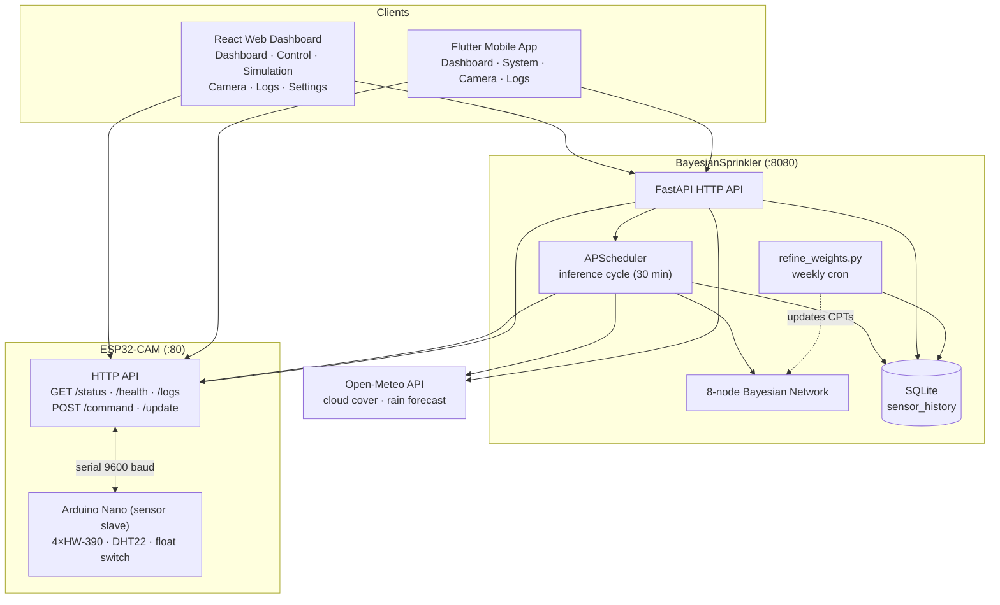
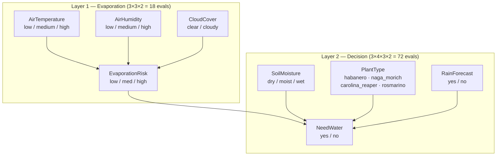

# 🚿 SmartSprinkler

## Summary
Autonomous irrigation system with Bayesian decision-making, ESP32 relay control, OTA firmware updates, a React web dashboard, and a Flutter mobile app for manual override

## What this project is
SmartSprinkler is a smart irrigation system that uses a Bayesian network to optimize water usage based on environmental factors and plant-specific needs. Designed to be efficient and adaptable, it aims to reduce water waste while improving plant health.

The system fuses on-device sensor readings (4 soil moisture probes, a DHT22, and a water-level float) with internet weather data (Open-Meteo) to decide per plant whether to water. A Python/FastAPI server runs the autonomous decision loop, a React web dashboard and a Flutter mobile app let the user monitor and control the system remotely, and the ESP32 firmware supports over-the-air updates and on-device event logging.

### Project Status
The project is in advanced development stage. All main components are operational:

- **ESP32 Hardware**: fully functional with air temperature/humidity (DHT22), 4 soil moisture sensors (HW-390), water-level float switch, pump relay, 3D-printed rotary selector (SG90 servo), on-device event logging and OTA updates
- **BayesianSprinkler Server**: 8-node Bayesian network, Open-Meteo API, automatic scheduler, per-plant soil routing, audit log, cistern tracking, statistics, and Bayesian weight refinement
- **Web Frontend (React)**: multi-tab dashboard with Dashboard, Control, Simulation, Camera, Logs, and Settings
- **Mobile App (Flutter)**: Dashboard, Camera, Logs, and System tabs with internal/external URL auto-switching

[//]: # (![smart_sprinkler_photo_open.jpg{width="500px"}{caption="The SmartSprinkler hardware: ESP32 controller, servo-driven rotary selector, sensor slave and tank"}]&#40;/summaries/smart_sprinkler_photo_open.jpg&#41;)

### Architecture
The system is composed of three main components: the ESP32-CAM hardware (with an Arduino Nano sensor slave), the BayesianSprinkler server (Python/FastAPI), and the clients (Flutter mobile app + React web frontend).



#### ESP32 + Arduino Nano Hardware
An ESP32-CAM is the main controller, with an Arduino Nano reading the sensors as a slave. The system exposes an HTTP API (port 80):

| Endpoint | Method | Purpose |
|---|---|---|
| `/status` | GET | Sensor snapshot (air temp/humidity, per-plant soil moisture, pump, rotary, water-low, active plant) |
| `/command` | POST | Irrigation control — start/stop, or dispense a specific amount (see example below) |
| `/health` | GET | Health check returning the auto-incremented per-build firmware version (see example below) |
| `/logs` | GET | On-device event-log tail (per day, filterable) |
| `/update` | POST | OTA firmware upload (`multipart/form-data`, dual-slot partition) |

Example payload for `POST /command`:

```json
{
  "action": "START | STOP | DISPENSE_SPECIFIC_AMOUNT",
  "target": "PLANT_NAME",
  "amount": 500,
  "force": true
}
```

Example response for `GET /health`:

```json
{ "status": "ok", "version": "1.2.7" }
```

The ESP32 controls a water pump connected to an external tank (GPIO 12). Plant selection is done via a **3D-printed rotary selector** driven by an **SG90 servo motor** (GPIO 13), which directs water flow to the selected plant. The Nano reads 4 HW-390 soil moisture sensors, a DHT22, and a water level float switch, communicating with the ESP32 via a 9600 baud software serial link.

The system supports 4 plants: Habanero, Naga Morich, Carolina Reaper, and Rosmarino, each with its own `sensor_index`, soil threshold, and water needs. Servo positions (start 5°, step 19°): Rosmarino (24°), Carolina Reaper (43°), Naga Morich (62°), Habanero (81°).

On boot the servo runs a non-blocking calibration sweep (position auto-verify, fallback to software-only tracking if it fails). Firmware versioning is automated per build and exposed via `/health`, enabling OTA version checks from any client.


#### BayesianSprinkler Server
FastAPI server (port 8080) that manages the autonomous decision loop. It exposes the following endpoints:

| Endpoint | Method | Purpose |
|---|---|---|
| `/api/health` | GET | Health check |
| `/api/dashboard` | GET | Combined telemetry + per-plant need + weather in one request |
| `/api/plants/status` | GET | Per-plant `probability_of_need` (0–1) with evidence breakdown |
| `/api/weather/status` | GET | Cached Open-Meteo data (cloud cover, rain forecast, temp, humidity) |
| `/api/esp/status` | GET | Latest ESP snapshot the server captured (apps call this, not the ESP) |
| `/api/plants/manual-water` | POST | Log a human-triggered watering (`need_water=yes`), then trigger the ESP |
| `/api/cistern` | GET | Current tank level estimate (`level_ml`, `capacity_ml`, `level_pct`) |
| `/api/cistern/refill` | POST | Force the cistern estimate back to full (auto-deduced from `water_low_alert`) |
| `/api/audit-log` | GET / DELETE | Read / clear audit entries (filterable by `filter` / `category`) |
| `/api/audit-log/export` | GET | Download the audit log as CSV |
| `/api/esp/ota` | POST | Relay a firmware `.bin` upload to the ESP's `/update` (audit-logged) |
| `/api/esp/version` | GET | Installed firmware version, read from the ESP `/health` |
| `/api/statistics` | GET | Telemetry dataset powering the charts page (soil, cistern, ambient, waterings) |

**Bayesian model & decision loop:**
- **APScheduler**: a single background job every `poll_interval` (default 30 min) reads ESP sensors + weather, logs every plant's BN decision (`need_water=yes/no`) to SQLite, and waters plants above their probability threshold
- **Open-Meteo API**: integration for cloud cover and rain forecast
- **Audit log**: every inference, command, and error (with traceback) is logged and exportable
- **Cistern tracking**: estimates the tank level, deduces refills from the `water_low_alert` sensor
- **OTA relay**: streams firmware to the ESP and reads back the installed version
- **Statistics**: powers the telemetry chart page (soil moisture, cistern, ambient, waterings)

The decision threshold per plant sits between `P(need | moist)` and `P(need | dry)`, so the BN waters only once the soil actually reaches the "dry" state — preventing the over-watering caused by earlier thresholds. Soil moisture dominates the score (50%); rain is a mild 15% dampener that tips borderline cases without overriding a dry-soil/high-evaporation need.

##### The Bayesian Network
A single BN serves all plants. An intermediate `EvaporationRisk` node decouples the environmental layer (3×3×2 = 18 evaluations) from the decision layer (3×4×3×2 = 72 evaluations), keeping the CPTs compact instead of a full 648-entry table.



Each layer uses a weighted score over its parents, mapped to a distribution and then a decision:

```text
Evaporation  score = temp×0.4 + humidity×0.4 + cloud×0.2          → EvaporationRisk
NeedWater    score = base_need×0.2 + evap×0.3 + moisture×0.5      (×0.85 if rain)
```

| Area | Weight | Notes |
|---|---|---|
| Soil moisture | 50% | Dry soil is the primary signal to irrigate |
| Evaporation risk | 30% | High evaporation → faster water loss |
| Plant base need | 20% | Each species has different baseline requirements |
| Rain forecast | × 0.85 | Mild dampener — tips borderline cases, no hard override |


The dashboard displays the Bayesian network output for each plant as color-coded probability bars, showing how the evidence (soil moisture, evaporation risk, rain forecast) combines into a per-plant watering decision:

The `refine_weights.py` script runs weekly via cron. It uses Bayesian parameter estimation with a Dirichlet prior to blend the expert CPTs (`prior_strength`, default 50) with the collected empirical data:

```python
posterior = 
    (expert_CPT × prior_strength + empirical_counts) 
    / (prior_strength + total_observations)
```

<br/>
<br/>
<br/>
<br/>

#### React Web Frontend
Multi-tab web dashboard (React 18 + Vite + Tailwind):

| Tab | Description |
|---|---|
| Dashboard | Real-time ESP telemetry, weather context, cistern widget, per-plant `probability_of_need` bars |
| Control | 4 plant cards, Direct ESP / Via Bayesian toggle, amount presets, Start/Stop with loading guards |
| Simulation | Interactive inference-cycle simulation over configurable weather/soil scenarios |
| Camera | ESP32-CAM live video stream |
| Logs | Audit log viewer with error-count banner, "view errors" filter, expandable tracebacks |
| Settings | ESP32 URL, Bayesian server URL, polling interval (persisted to `localStorage`) |


#### Flutter Mobile App
The mobile app 4-tab interface (Dashboard, Camera, Logs, System):

| Tab | Description |
|---|---|
| Dashboard | Polls `/api/dashboard` (2s) — no direct ESP polling; shows temp, humidity, soil, pump, cistern |
| System | Plant dropdown, Direct ESP / Via Bayesian toggle, Start/Stop, dispense amount, network monitor |
| Camera | ESP32-CAM live video stream |
| Logs | Audit log viewer with error banner, "show errors" filter, expandable tracebacks |
| — | Water-level local notifications + internal/external URL auto-switching (SSID / reachability) |

#### Communication
The server has CORS enabled so the web frontend (served on a different port/container) can call it from any browser. The BayesianSprinkler server and web frontend are containerized with Docker and docker-compose. The firmware uses a dual-slot OTA partition so updates can be written to the inactive slot while the running one keeps working.

## GitHub
https://github.com/AleMuzzi/SmartSprinkler

## Technologies and tools
- **Languages:** Dart, C/C++, Python, JavaScript, TypeScript
- **Frameworks:** Flutter, PlatformIO, FastAPI, React + Vite, Tailwind CSS
- **Hardware:** ESP32-CAM, Arduino Nano, DHT22, HW-390 (×4), SG90 servo, Relay pump, float switch
- **Communication:** HTTP, RESTful API, OTA
- **Database:** SQLite
- **Design Patterns:** MVVM, Bayesian Network
- **Tools:** Docker, Nginx, APScheduler, Open-Meteo API, Mongoose
