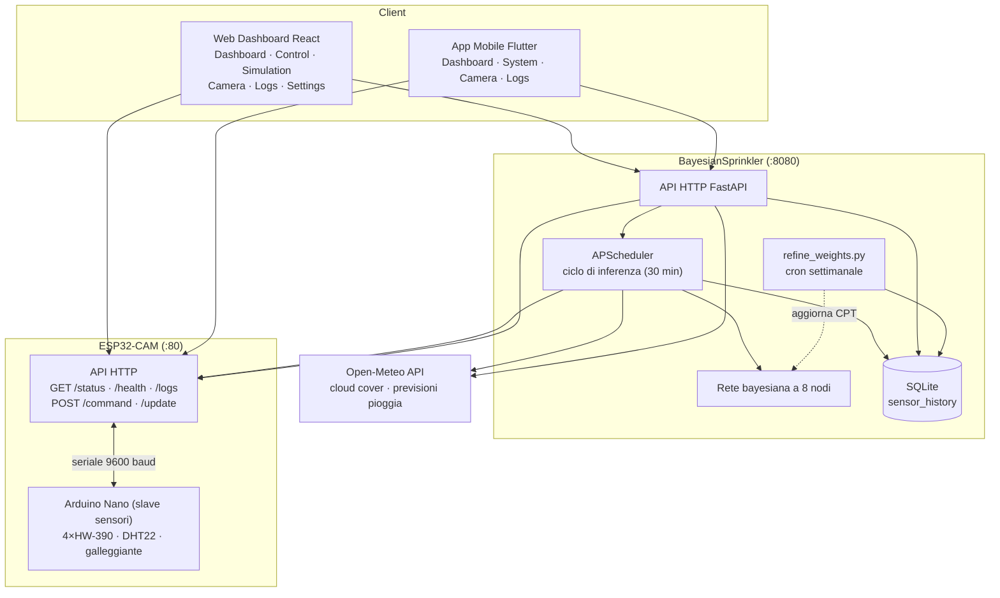
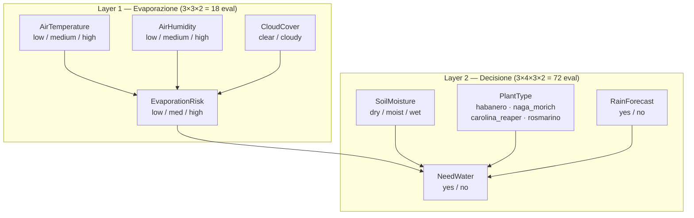

# 🚿 SmartSprinkler

## Summary
Sistema di irrigazione autonomo con decision-making bayesiano, controllo relay ESP32, aggiornamenti firmware OTA, web dashboard React e app mobile Flutter per override manuale

## What this project is
SmartSprinkler è un sistema di irrigazione intelligente che utilizza una rete bayesiana per ottimizzare l'uso dell'acqua in base a fattori ambientali e alle esigenze specifiche delle piante. Progettato per essere efficiente e adattabile, mira a ridurre gli sprechi d'acqua migliorando al contempo la salute delle piante.

Il sistema fonde le letture dei sensori locali (4 sensori di umidità del suolo, un DHT22 e un galleggiante per il livello dell'acqua) con i dati meteorologici da internet (Open-Meteo) per decidere, pianta per pianta, se irrigare. Un server Python/FastAPI esegue il ciclo decisionale autonomo, un web dashboard React e un'app mobile Flutter consentono all'utente di monitorare e controllare il sistema da remoto, e il firmware ESP32 supporta aggiornamenti over-the-air e logging degli eventi sul dispositivo.

### Stato del Progetto
Il progetto è in fase di sviluppo avanzato. Tutte le componenti principali sono operative:

- **Hardware ESP32**: completamente funzionante con temperatura/umidità aria (DHT22), 4 sensori di umidità suolo (HW-390), galleggiante livello acqua, relay pompa, selettore rotante stampato in 3D (servo SG90), logging eventi on-device e aggiornamenti OTA
- **Server BayesianSprinkler**: rete bayesiana a 8 nodi, integrazione Open-Meteo API, scheduler automatico, routing per-pianta del suolo, audit log, tracciamento cisterna, statistiche e raffinamento bayesiano dei pesi
- **Web Frontend (React)**: dashboard multi-tab con Dashboard, Control, Simulation, Camera, Logs e Settings
- **App Mobile (Flutter)**: tab Dashboard, Camera, Logs e System con commutazione automatica URL interno/esterno

[//]: # (![smart_sprinkler_photo_open.jpg{width="500px"}{caption="L'hardware di SmartSprinkler: controller ESP32, selettore rotante motorizzato, slave sensori e serbatoio"}]&#40;/summaries/smart_sprinkler_photo_open.jpg&#41;)

### Architettura
Il sistema è composto da tre componenti principali: l'hardware ESP32-CAM (con Arduino Nano come slave per i sensori), il server BayesianSprinkler (Python/FastAPI), e i client (app mobile Flutter + web frontend React).



#### Hardware ESP32 + Arduino Nano
Un ESP32-CAM è il controller principale, con un Arduino Nano che legge i sensori come slave. Il sistema espone un'API HTTP (porta 80):

| Endpoint | Metodo | Scopo |
|---|---|---|
| `/status` | GET | Snapshot sensori (temp/umidità aria, umidità suolo per pianta, pompa, rotante, acqua bassa, pianta attiva) |
| `/command` | POST | Controllo irrigazione — start/stop, o dispensa quantità specifica (esempio sotto) |
| `/health` | GET | Health check che restituisce la versione firmware auto-incrementata a ogni build (esempio sotto) |
| `/logs` | GET | Coda del log eventi on-device (per giorno, filtrabile) |
| `/update` | POST | Upload firmware OTA (`multipart/form-data`, partizione a doppio slot) |

Esempio di payload per `POST /command`:

```json
{
  "action": "START | STOP | DISPENSE_SPECIFIC_AMOUNT",
  "target": "PLANT_NAME",
  "amount": 500,
  "force": true
}
```

Esempio di risposta per `GET /health`:

```json
{ "status": "ok", "version": "1.2.7" }
```

L'ESP32 controlla una pompa per l'acqua collegata a un serbatoio esterno (GPIO 12). La selezione della pianta avviene tramite un **selettore rotante stampato in 3D** azionato da un **servo motore SG90** (GPIO 13), che indirizza il flusso d'acqua verso la pianta selezionata. Il Nano legge 4 sensori di umidità del suolo HW-390, un DHT22 e un galleggiante per il livello dell'acqua, comunicando con l'ESP32 tramite seriale software a 9600 baud.

Il sistema supporta 4 piante: Habanero, Naga Morich, Carolina Reaper e Rosmarino, ciascuna con il proprio `sensor_index`, soglia del suolo e necessità idriche. Le posizioni del servo (partenza 5°, step 19°): Rosmarino (24°), Carolina Reaper (43°), Naga Morich (62°), Habanero (81°).

All'avvio il servo esegue una calibrazione non bloccante (verifica automatica delle posizioni, con fallback al solo tracciamento software in caso di errore). Il versionamento del firmware è automatizzato per build ed esposto via `/health`, consentendo il controllo della versione OTA da qualsiasi client.


#### BayesianSprinkler Server
Server FastAPI (porta 8080) che gestisce il processo decisionale autonomo. Espone i seguenti endpoint:

| Endpoint | Metodo | Scopo |
|---|---|---|
| `/api/health` | GET | Health check |
| `/api/dashboard` | GET | Telemetria combinata + necessità per pianta + meteo in una sola richiesta |
| `/api/plants/status` | GET | `probability_of_need` per pianta (0–1) con dettaglio delle evidenze |
| `/api/weather/status` | GET | Dati Open-Meteo in cache (cloud cover, previsioni pioggia, temp, umidità) |
| `/api/esp/status` | GET | Ultimo snapshot ESP catturato dal server (le app chiamano questo, non l'ESP) |
| `/api/plants/manual-water` | POST | Registra un'irrigazione manuale (`need_water=yes`), poi attiva l'ESP |
| `/api/cistern` | GET | Stima livello serbatoio (`level_ml`, `capacity_ml`, `level_pct`) |
| `/api/cistern/refill` | POST | Riporta la stima della cisterna a piena (dedotta anche da `water_low_alert`) |
| `/api/audit-log` | GET / DELETE | Lettura / cancellazione voci audit (filtrabili per `filter` / `category`) |
| `/api/audit-log/export` | GET | Download dell'audit log come CSV |
| `/api/esp/ota` | POST | Relay di un upload firmware `.bin` verso `/update` dell'ESP (con audit log) |
| `/api/esp/version` | GET | Versione firmware installata, letta dall'ESP via `/health` |
| `/api/statistics` | GET | Dataset telemetria per la pagina grafici (suolo, cisterna, ambiente, irrigazioni) |

**Modello bayesiano e ciclo decisionale:**
- **APScheduler**: un singolo job di background ogni `poll_interval` (default 30 min) legge i sensori ESP + meteo, registra la decisione BN di ogni pianta (`need_water=yes/no`) su SQLite e irriga le piante sopra la loro soglia di probabilità
- **Open-Meteo API**: integrazione per cloud cover e previsioni pioggia
- **Audit log**: ogni inferenza, comando ed errore (con traceback) viene registrato ed esportabile
- **Tracciamento cisterna**: stima il livello del serbatoio e deduce i rabbocchi dal sensore `water_low_alert`
- **Relay OTA**: trasmette un firmware all'ESP e legge la versione installata
- **Statistiche**: alimenta la pagina grafici di telemetria (umidità suolo, cisterna, ambiente, irrigazioni)

La soglia di decisione per pianta è compresa tra `P(need | moist)` e `P(need | dry)`, così la BN irriga solo quando il suolo raggiunge davvero lo stato "dry" — prevenendo l'irrigazione eccessiva causata dalle soglie precedenti. L'umidità del suolo domina lo score (50%); la pioggia è un lieve smorzatore del 15% che ribalta i casi limite senza sovrascrivere una necessità da suolo asciutto/forte evaporazione.

##### La Rete Bayesiana
Un'unica BN serve tutte le piante. Un nodo intermedio `EvaporationRisk` disaccoppia lo strato ambientale (3×3×2 = 18 valutazioni) da quello decisionale (3×4×3×2 = 72 valutazioni), mantenendo compatte le CPT invece di una tabella completa da 648 voci.



Ogni layer usa uno score pesato sui suoi padri, mappato a una distribuzione e poi a una decisione:

```text
Evaporazione  score = temp×0.4 + umidità×0.4 + cloud×0.2       → EvaporationRisk
NeedWater     score = base_need×0.2 + evap×0.3 + moisture×0.5  (×0.85 se piove)
```

| Area | Peso | Note |
|---|---|---|
| Umidità del suolo | 50% | Il suolo asciutto è il segnale primario per irrigare |
| Rischio evaporazione | 30% | Alta evaporazione → perdita d'acqua più veloce |
| Necessità base pianta | 20% | Ogni specie ha requisiti di base differenti |
| Previsione pioggia | × 0.85 | Smorzamento lieve — ribalta i casi limite, nessun override rigido |


La dashboard mostra l'output della rete bayesiana per ogni pianta come barre di probabilità codificate a colore, visualizzando come le evidenze (umidità suolo, rischio evaporazione, previsioni pioggia) si combinano nella decisione di irrigazione:

Lo script `refine_weights.py` viene eseguito settimanalmente via cron. Usa la stima bayesiana dei parametri con prior di Dirichlet per fondere le CPT esperte (`prior_strength`, default 50) con i dati empirici raccolti:

```python
posterior = 
    (expert_CPT × prior_strength + conteggi_empirici) 
    / (prior_strength + osservazioni_totali)
```

<br/>
<br/>
<br/>
<br/>

#### Web Frontend React

Dashboard web multi-tab (React 18 + Vite + Tailwind):

| Tab        | Descrizione                                                                                                |
|------------|------------------------------------------------------------------------------------------------------------|
| Dashboard  | Telemetria ESP in tempo reale, contesto meteo, widget cisterna, barre `probability_of_need` per pianta     |
| Control    | 4 card pianta, toggle Direct ESP / Via Bayesian, preset quantità, Start/Stop con protezione da doppi click |
| Simulation | Simulazione interattiva del ciclo di inferenza su scenari meteo/suolo configurabili                        |
| Camera     | Streaming video live dall'ESP32-CAM                                                                        |
| Logs       | Visualizzatore audit log con banner conteggio errori, filtro "vedi errori", traceback espandibili          |
| Settings   | URL ESP32, URL server bayesiano, polling interval (persistiti in `localStorage`)                           |


#### Mobile App Flutter
L'app mobile con interfaccia a 4 tab (Dashboard, Camera, Logs, System):

| Tab       | Descrizione                                                                                                     |
|-----------|-----------------------------------------------------------------------------------------------------------------|
| Dashboard | Interroga `/api/dashboard` (2s) — nessun polling diretto dell'ESP; mostra temp, umidità, suolo, pompa, cisterna |
| Camera    | Streaming video live dall'ESP32-CAM                                                                             |
| Logs      | Visualizzatore audit log con banner errori, filtro "vedi errori", traceback espandibili                         |
| System    | Dropdown pianta, toggle Direct ESP / Via Bayesian, Start/Stop, quantità da dispensare, network monitor          |
| —         | Notifiche locali livello acqua + commutazione automatica URL interno/esterno           |

#### Comunicazione
Il server abilita il CORS così il web frontend (servito su porta/container diversa) può chiamarlo da qualsiasi browser. Il server BayesianSprinkler e il web frontend sono containerizzati con Docker e docker-compose. Il firmware usa una partizione OTA a doppio slot così gli aggiornamenti possono essere scritti nello slot inattivo mentre quello attivo continua a funzionare.

## GitHub
https://github.com/AleMuzzi/SmartSprinkler

## Tecnologie e strumenti
- **Linguaggi:** Dart, C/C++, Python, JavaScript, TypeScript
- **Framework:** Flutter, PlatformIO, FastAPI, React + Vite, Tailwind CSS
- **Hardware:** ESP32-CAM, Arduino Nano, DHT22, HW-390 (×4), servo SG90, relay pompa, galleggiante
- **Comunicazione:** HTTP, RESTful API, OTA
- **Database:** SQLite
- **Design Pattern:** MVVM, Bayesian Network
- **Strumenti:** Docker, Nginx, APScheduler, Open-Meteo API, Mongoose
